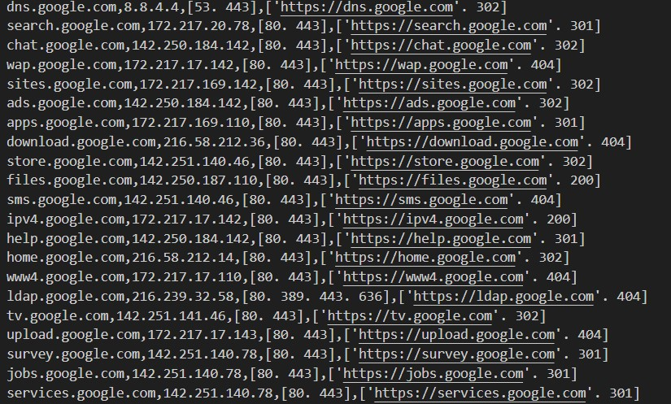

 This tool can find subdomains,İp addres, open ports and websites.
 <h3>used nmap,dns.resolver and httpx model.</h3>
 <h3>You can input txt file or  domain.Then tool will discover subdomains ip address and open ports </h3>
 <h2>How it works</h2>
 <h3>1.İnput a domain or file</h3>
 <code>Python Asset_discovery.py google.com</code>
 <h3>Result</h3>

